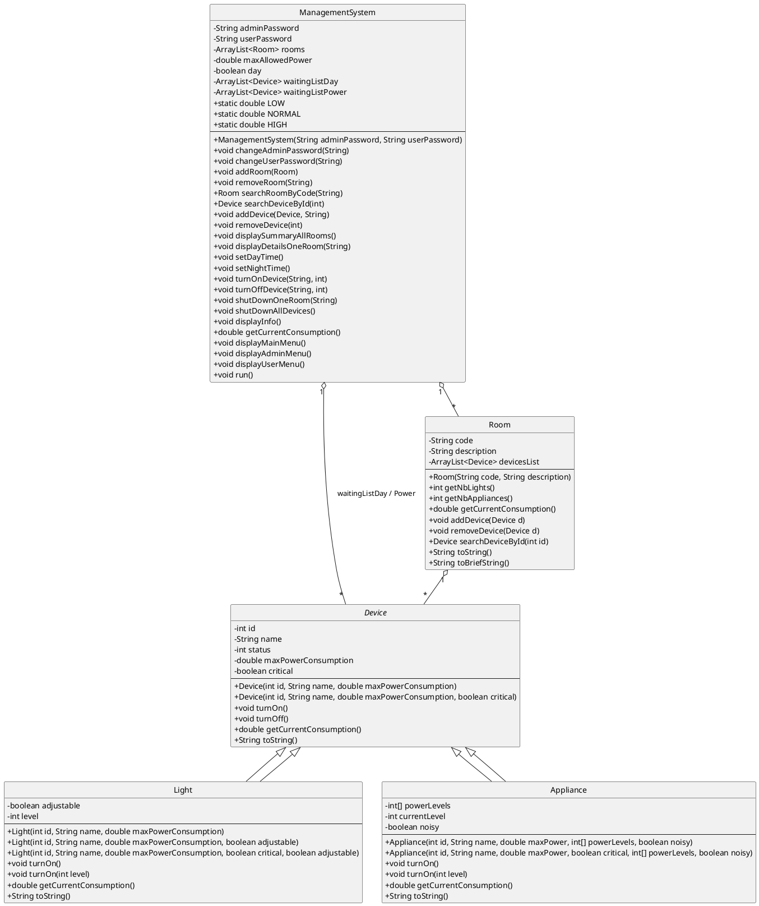

# sm_management

--- 
## UML

```puml
@startuml
skinparam classAttributeIconSize 0
skinparam style strictuml

' ========== ABSTRACT DEVICE ==========
abstract class Device {
  - int id
  - String name
  - int status
  - double maxPowerConsumption
  - boolean critical
  --
  + Device(int id, String name, double maxPowerConsumption)
  + Device(int id, String name, double maxPowerConsumption, boolean critical)
  + void turnOn()
  + void turnOff()
  + double getCurrentConsumption()
  + String toString()
}

' ========== LIGHT ==========
class Light extends Device {
  - boolean adjustable
  - int level
  --
  + Light(int id, String name, double maxPowerConsumption)
  + Light(int id, String name, double maxPowerConsumption, boolean adjustable)
  + Light(int id, String name, double maxPowerConsumption, boolean critical, boolean adjustable)
  + void turnOn()
  + void turnOn(int level)
  + double getCurrentConsumption()
  + String toString()
}

' ========== APPLIANCE ==========
class Appliance extends Device {
  - int[] powerLevels
  - int currentLevel
  - boolean noisy
  --
  + Appliance(int id, String name, double maxPower, int[] powerLevels, boolean noisy)
  + Appliance(int id, String name, double maxPower, boolean critical, int[] powerLevels, boolean noisy)
  + void turnOn()
  + void turnOn(int level)
  + double getCurrentConsumption()
  + String toString()
}

' ========== ROOM ==========
class Room {
  - String code
  - String description
  - ArrayList<Device> devicesList
  --
  + Room(String code, String description)
  + int getNbLights()
  + int getNbAppliances()
  + double getCurrentConsumption()
  + void addDevice(Device d)
  + void removeDevice(Device d)
  + Device searchDeviceById(int id)
  + String toString()
  + String toBriefString()
}

' ========== MANAGEMENT SYSTEM ==========
class ManagementSystem {
  - String adminPassword
  - String userPassword
  - ArrayList<Room> rooms
  - double maxAllowedPower
  - boolean day
  - ArrayList<Device> waitingListDay
  - ArrayList<Device> waitingListPower
  + static double LOW
  + static double NORMAL
  + static double HIGH
  --
  + ManagementSystem(String adminPassword, String userPassword)
  + void changeAdminPassword(String)
  + void changeUserPassword(String)
  + void addRoom(Room)
  + void removeRoom(String)
  + Room searchRoomByCode(String)
  + Device searchDeviceById(int)
  + void addDevice(Device, String)
  + void removeDevice(int)
  + void displaySummaryAllRooms()
  + void displayDetailsOneRoom(String)
  + void setDayTime()
  + void setNightTime()
  + void turnOnDevice(String, int)
  + void turnOffDevice(String, int)
  + void shutDownOneRoom(String)
  + void shutDownAllDevices()
  + void displayInfo()
  + double getCurrentConsumption()
  + void displayMainMenu()
  + void displayAdminMenu()
  + void displayUserMenu()
  + void run()
}

' ========== RELATIONSHIPS ==========
Device <|-- Light
Device <|-- Appliance
Room "1" o-- "*" Device
ManagementSystem "1" o-- "*" Room
ManagementSystem "1" o-- "*" Device : waitingListDay / Power
@enduml
```
